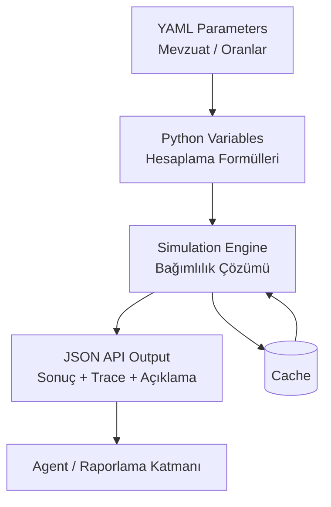
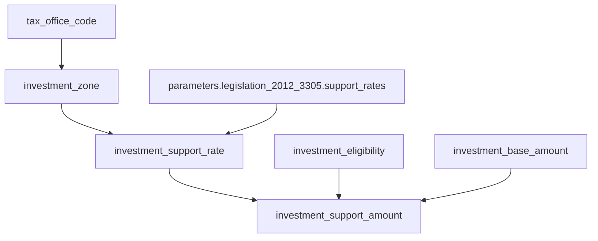
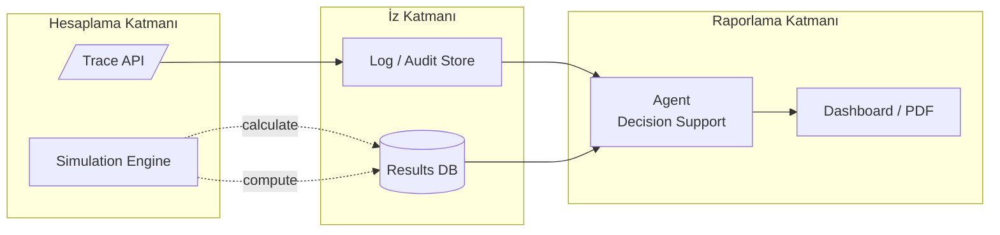

# OpenFisca Geliştirici Rehberi – Nihai Teknik Doküman

Bu rehber, OpenFisca ekosisteminin mimari yapısını ve mevzuat temelli yatırım teşvik, vergi ve sosyal politika modellerinde nasıl kullanılacağını uçtan uca anlatır. Amaç, modeli SOLID prensipleriyle güçlendirmek, bağımlılık zincirini (dependency chain) görünür kılmak, `RegionResolver` benzeri soyutlamaları yerleştirmek, loglama/performans/test/reform süreçlerini kurumsal seviyeye taşımak ve Agent tabanlı raporlama katmanıyla birlikte şeffaf, sürdürülebilir ve denetlenebilir çözümler üretmektir. Doküman özellikle konuya yeni katılacak stajyer geliştiricileri de hedeflediği için kod parçalarında ek açıklayıcı yorumlar bulunur.

---

## 1. OpenFisca Mimarisine Genel Bakış

OpenFisca, mevzuat temelli hesaplama sistemleri kurmak için tasarlanmış, Python ile yazılmış özgür (AGPLv3) bir motordur. Modelleme dili YAML tabanlıdır ve çekirdek şu bileşenlerden oluşur:

- **Variables**: Her hesaplama değişkeni ayrı bir sınıf olarak tanımlanır (örn. `investment_support_amount`).
- **Parameters**: Tarihli mevzuat değerleri YAML dosyalarında tutulur; yeni mevzuat geldiğinde dosyaya tarih blokları eklenir.
- **Simulation**: Girdileri alır, bağımlılık zincirini çözer ve sonuçları üretir.
- **Web API**: Motoru JSON tabanlı REST servisi olarak dışa açar (`openfisca serve`).
- **Testing Framework**: YAML senaryoları ve/veya pytest tabanlı otomasyon sağlar (`openfisca test`).

### 1.1 Teknolojik Altyapı (Python + YAML + JSON)

- **Çekirdek** Python ile yazılmıştır; `openfisca-core` paketinde bulunur.  
- **Parametreler** YAML dosyalarıdır; tarihli mevzuat oranlarını içerir.  
- **Sonuçlar** JSON olarak döner; dış sistemlere entegrasyon kolaydır.  
- **CLI / API** Python’un `click`, `Flask/Werkzeug` ve benzeri kütüphaneleriyle sağlanır.  
- **Test** altyapısı pytest + YAML ile otomasyona uygundur.  
- **Performans** tarafında NumPy vektörleştirme ve OpenFisca’nın cache mekanizmaları kullanılır.



> İpucu: Mermaid diyagramı GitHub ve GitLab’da doğrudan render edilir; dokümanı PDF’e dönüştürürken `mmdc` veya benzeri araçlarla görüntüye çevirebilirsiniz.

**Örnek API Çağrısı**

```bash
curl -X POST http://localhost:5000/calculate \
     -H 'Content-Type: application/json' \
     -d '{
       "variables": ["investment_support_amount"],
       "entities": {
         "establishments": {
           "establishment_1": {
             "investment_scale": "medium",
             "investment_zone": "zone1",
             "investment_base_amount": 1000000
           }
         }
       }
     }'
```

JSON çıktısı:

```json
{
  "investment_support_amount": {
    "establishment_1": 250000.0
  }
}
```

---

## 2. SOLID Prensipleri ve OpenFisca Uygulamaları

OpenFisca’nın değişken bazlı tasarımı SOLID prensipleriyle doğal olarak örtüşür. Aşağıdaki örneklerde her prensip hem Türkçe hem İngilizce olarak açıklanır ve stajyerler için yorum satırları eklenir.

### 2.1 Single Responsibility Principle (Tek Sorumluluk Prensibi)

Her sınıf veya dosya tek bir sorumluluk üstlenmelidir. OpenFisca’da:

- Parametreler: Sadece mevzuat değerlerini saklar.
- Değişkenler: Yalnızca hesaplama yapar.
- Testler: Tek davranışı doğrular.

```python
from openfisca_core.model_api import Variable, periods

class InvestmentEligibility(Variable):
    """SRP → Bu sınıfın tek görevi yatırımın uygun olup olmadığını söylemek."""

    value_type = bool
    entity = ...
    definition_period = periods.YEAR

    def formula(entity, period, parameters):
        # Yalnızca ölçek bilgisini okuyor; başka hiçbir sorumluluk almıyor.
        scale = entity("investment_scale", period)
        return scale in {"medium", "large"}
```

### 2.2 Open/Closed Principle (Açık/Kapalı Prensibi)

Sistem yeni davranışlara açık, mevcut kodu değiştirmeye kapalı olmalıdır. Yeni mevzuat geldiğinde sadece YAML’ye tarih blokları eklenir:

```yaml
# parameters/legislation_2012_3305/support_rates.yaml
values:
  2012-06-19:
    zone1:
      medium: 0.25
      large: 0.30
  2024-01-01:
    zone1:
      medium: 0.27
      large: 0.32
metadata:
  reference: "2012/3305 sayılı Karar"
```

### 2.3 Liskov Substitution Principle (Liskov Yerine Geçme Prensibi)

Alt sınıflar üst sınıfın sözleşmesini bozmadan kullanılmalıdır. Tüm değişkenler `Variable` sınıfının imzasını (formula(entity, period, parameters)) korur:

```python
class InvestmentSupportRate(Variable):
    """LSP → Variable sözleşmesine sadık kalarak oran hesaplar."""

    value_type = float
    entity = ...
    definition_period = periods.YEAR

    def formula(entity, period, parameters):
        zone = entity("investment_zone", period)
        scale = entity("investment_scale", period)
        rates = parameters.legislation_2012_3305.support_rates
        return rates[zone][scale]
```

### 2.4 Interface Segregation Principle (Arayüz Ayrımı Prensibi)

Sınıflar yalnızca ihtiyaç duydukları verilere erişmelidir. Aşırı bağımlılık testi zorlaştırır:

```python
class InvestmentSupportAmount(Variable):
    """ISP → Yalnızca gerekli girdileri kullanarak destek tutarını hesaplar."""

    value_type = float
    entity = ...
    definition_period = periods.YEAR

    def formula(entity, period, parameters):
        # Gereksiz bağımlılık yok; eligibility, base_amount ve rate yeterli.
        if not entity("investment_eligibility", period):
            return 0.0
        base = entity("investment_base_amount", period)
        rate = entity("investment_support_rate", period)
        return base * rate
```

### 2.5 Dependency Inversion Principle (Bağımlılıkların Ters Çevrilmesi Prensibi)

Üst seviye modüller somut sınıflara değil soyutlamalara bağımlı olmalıdır. `RegionResolver` bunu sağlar:

```python
from abc import ABC, abstractmethod

class RegionResolver(ABC):
    """DIP → Bu arayüz, bölge bilgisini nasıl çözeceğimizi soyutlar."""

    @abstractmethod
    def resolve(self, tax_office_code: str) -> str:
        """Verilen vergi dairesi kodunu (örn. 3401) bölgeye (zone1) çevirir."""

class ParameterRegionResolver(RegionResolver):
    """Somut sınıf sadece parametrelere erişim detayını içerir."""

    def __init__(self, mapping: dict[str, str]) -> None:
        self._mapping = mapping

    def resolve(self, tax_office_code: str) -> str:
        # Üst seviye kod bu detayları bilmez; yalnızca resolve çağırır.
        return self._mapping.get(tax_office_code, "UNKNOWN")
```

Formül sınıfı soyutlamaya bağlanır:

```python
class InvestmentZone(Variable):
    """DIP → Resolver arayüzüne bağlı kalır, veri kaynağını bilmez."""

    value_type = str
    entity = ...
    definition_period = periods.YEAR

    def __init__(self, *, resolver: RegionResolver) -> None:
        super().__init__()
        self._resolver = resolver  # Soyut arayüz enjekte edilir.

    def formula(self, entity, period, parameters):
        code = entity("tax_office_code", period)
        return self._resolver.resolve(code)
```

---

## 3. Dependency Chain (Bağımlılık Zinciri) ve İzlenebilirlik

Değişkenler birbirini çağırdıkça doğal bir zincir oluşur. Aşağıdaki diyagram `investment_support_amount` değişkeninin veri kaynağına kadar izini gösterir:



Bu zincir, sonuçların hangi veri ve parametrelerden geçtiğini gösterir. Açıklanabilirlik için `/trace` endpoint’i kullanılabilir:

```python
import requests

payload = {
    "period": "2014",
    "entities": {
        "establishments": {
            "e1": {
                "tax_office_code": "3401",
                "investment_scale": "medium",
                "investment_type": "new_investment",
                "investment_base_amount": 1_000_000
            }
        }
    },
    "variables": ["investment_support_amount"]
}

resp = requests.post("http://localhost:5000/trace", json=payload, timeout=30)
resp.raise_for_status()
trace = resp.json()
print(trace["graph"]["nodes"])   # Değişken/parametre düğümleri
print(trace["graph"]["edges"])   # Bağımlılık bağlantıları
print(trace["explanations"])     # Metinsel açıklamalar
```

---

## 4. Resolver Katmanları

Resolver soyutlamaları, dış dünyadaki kodları (vergi dairesi, NACE, GTİP vb.) OpenFisca’nın beklediği anahtarlara dönüştürmek için kullanılır.

### 4.1 RegionResolver

```python
class RegionResolver(ABC):
    """Vergi dairesi → Bölge eşlemesi için soyut sözleşme."""

    @abstractmethod
    def resolve(self, code: str, period=None) -> str:
        """Kodu (örn. '3401') OpenFisca zonuna çevirir."""

class ParameterRegionResolver(RegionResolver):
    def __init__(self, parameters):
        self._parameters = parameters

    def resolve(self, code: str, period=None) -> str:
        table = self._parameters.regions.office_to_zone(period)
        return table.get(code, "UNKNOWN")
```

### 4.2 SectorResolver

```yaml
# parameters/legislation_2012_3305/sector_mapping.yaml
values:
  2012-06-19:
    EK2A:
      NACE10: food_processing
      NACE13: textile
    EK2B:
      NACE26: electronics
  2025-01-01:
    EK5_GTİP:
      9403.90.10: furniture_parts
      7308.90.90: steel_structures
metadata:
  reference: "2012/3305 Ek-2A, Ek-2B, Ek-5"
```

```python
class SectorResolver(ABC):
    """NACE, GTİP gibi kodları teşvik sınıflarına eşleyen arayüz."""

    @abstractmethod
    def resolve(self, code: str, period=None) -> str:
        """Dış kodu (örn. 'NACE10') iç anahtara çevirir."""

class ParameterSectorResolver(SectorResolver):
    def __init__(self, parameters):
        self._parameters = parameters

    def resolve(self, code: str, period=None) -> str:
        mapping = self._parameters.legislation_2012_3305.sector_mapping(period)
        tables = {}
        tables.update(mapping.get("EK2A", {}))
        tables.update(mapping.get("EK2B", {}))
        tables.update(mapping.get("EK5_GTİP", {}))
        return tables.get(code, "UNKNOWN")
```

---

## 5. İzlenebilirlik, Loglama, Performans, Test ve Reform

### 5.1 İzlenebilirlik ve Loglama

- `/trace` ve `/explain` endpoint’leri, hangi değişkenin hangi parametreyle değerlendiğini açıklar.
- Formüllere `logging` çağrıları eklenebilir; örneğin:

```python
import logging
logger = logging.getLogger(__name__)

class InvestmentSupportAmount(Variable):
    ...
    def formula(entity, period, parameters):
        base = entity("investment_base_amount", period)
        rate = entity("investment_support_rate", period)
        logger.debug("base=%s rate=%s", base, rate)  # Debug log
        ...
```

### 5.2 Performans

- Simulation nesneleri sonuçları cache eder; aynı değişken tekrar hesaplanmaz.
- Yoğun senaryolarda `simulation.calculate_add('var')` yerine `simulation.compute('var')` kullanarak vektörleştirilmiş çözümden yararlanılabilir.
- Çok büyük veri setleri için parametreleri sadeleştirmek ve gereksiz bağımlılıkları kaldırmak performansa direkt katkı sağlar.

### 5.3 Test Stratejisi

- **Birim Testleri**: Her değişkeni ayrı test edin, bağımlı değişkenleri sahte (stub) değerlerle besleyin.
- **YAML Senaryoları**: `openfisca test tests/investment_support.yaml`
- **Pytest**: Aşağıdaki gibi fixture’lar ile otomasyon:

```python
import pytest
from openfisca_core.simulation_builder import SimulationBuilder

@pytest.fixture
def tax_benefit_system():
    builder = SimulationBuilder()
    resolver = ParameterRegionResolver(mapping={"3401": "zone1", "0602": "zone2"})
    builder.add_variables(
        InvestmentZone(resolver=resolver),
        InvestmentEligibility(),
        InvestmentSupportRate(),
        InvestmentSupportAmount(),
    )
    return builder.build()
```

**Örnek YAML Test Dosyası**

```yaml
# tests/investment_support.yaml
- name: medium scale zone1
  period: 2014-01-01
  input:
    entities:
      establishments:
        data:
          establishment_1:
            tax_office_code: "3401"
            investment_scale: medium
            investment_base_amount: 1_000_000
  expected:
    investment_support_amount:
      establishment_1: 250000.0

- name: micro scale is not eligible
  period: 2014-01-01
  input:
    entities:
      establishments:
        data:
          establishment_2:
            tax_office_code: "0602"
            investment_scale: micro
            investment_base_amount: 500_000
  expected:
    investment_eligibility:
      establishment_2: false
    investment_support_amount:
      establishment_2: 0.0
```

```bash
# YAML senaryolarını CLI üzerinden doğrulama
openfisca test tests/investment_support.yaml
```

### 5.4 Reform Mekanizması (Detaylı)

Reform, mevcut mevzuata alternatif bir senaryo tanımlamaya yarar. Örneğin 2025 sonrası teşvik oranlarını test etmek için reform paketleri oluşturabilirsiniz.

**Adım 1 – Reform Sınıfı Yazma**

```python
from openfisca_core.reforms import Reform

class InvestmentReform2025(Reform):
    """Reform → Baseline mevzuatı değiştirmeden alternatif senaryo oluşturur."""

    def apply(self):
        # Parametreyi güncelleyen helper fonksiyon
        self.modify_parameters(additional_rates)
```

**Adım 2 – Parametre Güncellemesi**

```python
def additional_rates(parameters):
    # 2025 itibarıyla oran değişsin
    rates = parameters.legislation_2012_3305.support_rates
    rates.update({
        "zone1": {
            "medium": 0.30,
            "large": 0.35,
        }
    })
```

**Adım 3 – Reformu Baseline ile Karşılaştırma**

```python
from openfisca_core.simulation_builder import SimulationBuilder

baseline = SimulationBuilder().build_from_package("my_incentives")
reform_sim = baseline.reform(InvestmentReform2025)

baseline_result = baseline.calculate("investment_support_amount", "2024")
reform_result = reform_sim.calculate("investment_support_amount", "2025")

delta = reform_result - baseline_result  # Politika etkisini ölç
```

**Reform İçin İyi Uygulamalar**

- Reform dosyalarını `reforms/` klasöründe tutun; parametrik değişiklikleri net isimlendirin.
- Her reform için ayrı YAML test senaryosu hazırlayın (`expected` sonuçlarıyla).
- Yönetim raporlarında baseline/reform karşılaştırmasını net şekilde paylaşın.

---

## 6. Agent ve Raporlama Entegrasyonu

OpenFisca çıktıları, Agent veya raporlama katmanlarına beslenebilir. Tipik bir pipeline:



1. **Hesaplama Katmanı**: OpenFisca simulation (`calculate`/`trace`).
2. **İz Katmanı**: Trace + Explanation JSON; mevzuat referanslarıyla saklanır.
3. **Raporlama Katmanı**: Agent, PDF/Word/BI aracına verileri gönderir; yönetime anlaşılır raporlar sunar.

Agent, hem hesaplanan NA değerlerini hem de açıklama metinlerini birleştirerek “Neden bu teşvik oranı çıktı?” sorusuna otomatik yanıt üretir.

---

## 7. Nihai Değerlendirme ve Öneriler

- OpenFisca, mevzuat temelli karar sistemleri için güçlü ve şeffaf bir motor sunar.
- SOLID prensipleri sayesinde kod tabanı sürdürülebilir ve test edilebilir kalır.
- `RegionResolver` gibi soyutlamalar veri kaynaklarının değişmesine karşı koruma sağlar.
- `/trace` ve reform mekanizmaları sayesinde üst yönetime açıklanabilir raporlar verilebilir.
- ProLegal gibi yatırım teşvik projelerinde:
  - Yeni mevzuat yalnızca YAML dosyalarına eklenir.
  - Trace çıktıları denetim süreçlerini kolaylaştırır.
  - Agent katmanı yönetici özetleri üretir.

---

## Ek: Kurulum ve İlk Adımlar

```bash
# Sanal ortam (önerilir)
python3 -m venv .venv
source .venv/bin/activate

# OpenFisca çekirdeği
pip install openfisca-core

# Örnek ülke paketi
pip install openfisca-france

# Yardım komutu
openfisca --help
```

**Örnek Kod – İlk Simülasyonu Çalıştırma**

```python
from openfisca_core.simulation_builder import SimulationBuilder
from my_package.variables import (
    InvestmentZone,
    InvestmentEligibility,
    InvestmentSupportRate,
    InvestmentSupportAmount,
)
from my_package.resolvers import ParameterRegionResolver

builder = SimulationBuilder()
resolver = ParameterRegionResolver(mapping={"3401": "zone1"})

builder.add_variables(
    InvestmentZone(resolver=resolver),
    InvestmentEligibility(),
    InvestmentSupportRate(),
    InvestmentSupportAmount(),
)

simulation = builder.build().new_simulation(
    period="2014",
    tax_office_code={"establishment_1": "3401"},
    investment_scale={"establishment_1": "medium"},
    investment_base_amount={"establishment_1": 1_000_000},
)

result = simulation.calculate("investment_support_amount", "2014")
print(result["establishment_1"])  # 250000.0
```

Kurulum tamamlandığında kendi ülke/paketinizi oluşturmak için `openfisca scaffold` komutunu kullanabilir veya mevcut projeyi klonlayıp değişken/parametre eklemeye başlayabilirsiniz.

---

Bu doküman, yeni başlayan bir geliştiricinin OpenFisca’yı SOLID çerçevesiyle birlikte anlamasına, mevzuat modelini kurmasına ve reform/test süreçlerini yönetmesine yardımcı olacak şekilde tasarlanmıştır. Sorular için teknik lead veya hukuk danışmanı ile birlikte ilerlemek en sağlıklı yaklaşım olacaktır.
