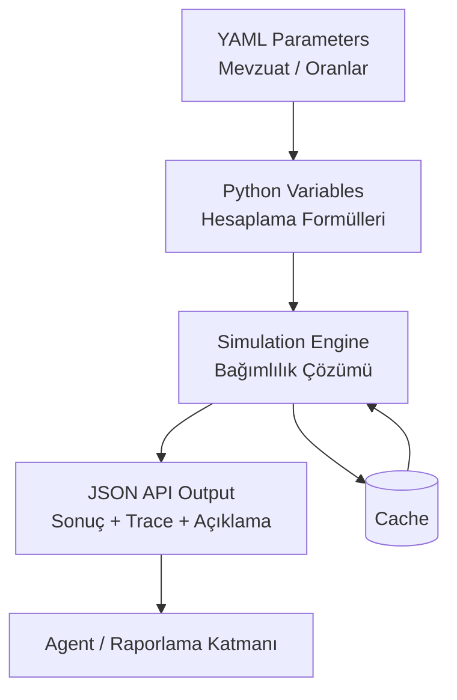
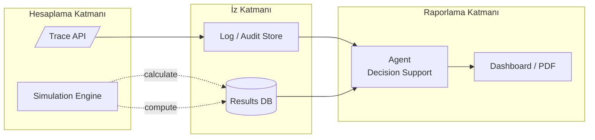

# OpenFisca Geliştirici Rehberi – Teknik Doküman

> **Kapsam:** Bu doküman, ekibimizde mevzuat tabanlı teşvik, vergi ve sosyal politika modelleri geliştiren tüm mühendislerin referans alabileceği, operasyonel ayrıntıları derinlemesine açıklayan teknik bir çalışma setidir.  
> **Hedef:** OpenFisca’yı; SOLID prensipleri, bağımlılık zinciri analizi, resolver soyutlamaları, loglama-performans-test-reform pratikleri ve Agent tabanlı raporlama katmanı ile birlikte kurumsal seviyeye taşımak.

---

## Giriş

### OpenFisca nedir? Kuramsal çerçeve
- OpenFisca, mevzuat temelli karar kurallarını Python değişkenleri olarak modellememizi sağlayan açık kaynak (AGPLv3) bir simülasyon motorudur.
- “Rules as Code” yaklaşımını benimser: mevzuat metinleri, parametrik YAML dosyaları ve açıklanabilir formüllerle kod haline getirilir.
- Kurallar kodlandıktan sonra simulation motoru, bağımlılık zincirini çözerek sonuç üretir; bu sonuçlar JSON/REST API üzerinden harici sistemlere verilebilir.

### “Rules as Code” yaklaşımı
- Hukuki metinler ve teşvik kuralları kodlanabilir hale geldiğinde, mevzuat değişikliklerinin etkisi otomatik olarak simüle edilebilir.
- Aynı mevzuat farklı senaryolar için tekrar tekrar çalıştırılabilir; reform senaryoları baseline ile kıyaslanabilir.
- Açıklanabilirlik ve denetlenebilirlik, motorun `/trace` özelliği sayesinde sağlanır.

### Türkiye’de neden önemli?
- Türkiye’de mevzuat değişim hızı yüksek; yatırım teşvik kararları, vergi istisnaları ve sosyal yardım programları sık güncelleniyor.
- Şeffaf ve izlenebilir simülasyonlarla politika analizi yapılması, karar destek mekanizmalarını güçlendirir.
- Teknopark projelerinde Ar-Ge, yeşil dönüşüm ve dijitalleşme gibi desteklerin etkisini ölçmek için OpenFisca hızlandırıcı rol oynayabilir.

### Türkiye mevzuatı ve uygunluk
- `mevzuat.gov.tr` verileri ve Resmî Gazete kararları, YAML parametrelerine dönüştürülerek kodlanabilir hale gelir.
- Türkçe dil kuralları, metinlerdeki yorum satırları ve mevzuatın sürekli revizyonu önemli zorluklardır.
- Veri erişimi, tarihsel versiyonlama ve yorum farklılıkları (örneğin “büyüme temelli yatırım” tanımı) kodlama sürecinde dikkat ister.

### Türkiye’ye özgü zorluklara hızlı bakış
- **Dil:** Türkçe karakterler ve uzun mevzuat cümleleri, parametre isimlendirmesinde özel dikkat gerektirir.  
- **Veri erişimi:** Resmî Gazete PDF’lerinden tablo çıkarmak emek ister; parser’lar gelişiyor.  
- **Hızlı değişim:** Geçici maddeler, ekler ve tebliğlerle mevzuat sık güncellenir; version control şart.  
- **Yorum ihtiyacı:** Her karar, hukuk danışmanı ile birlikte yorumlanmalı; kod yalnızca açık hükmü yansıtmalı.

### OpenFisca teknik özelliklerinin hatırlatması
- Python API ve Web API (REST) ile çalışır; CLI üzerinden `openfisca serve` ve `openfisca test` komutları mevcuttur.
- Kuralları kodladığımız her değişken, simulation içerisinde otomatik olarak bağımlılıklarıyla birlikte çözülür.
- Kullanım alanları: vergi matrahı, sosyal yardımlar, yatırım teşvikleri, çevresel düzenlemeler, Ar-Ge destekleri.

### Türkiye’ye özel senaryolar
- Örneğin Dijital Dönüşüm Destek Programı’nı modellemek:  
  - Parametrelerde bölge/ölçek eşikleri, destek oranları ve istisnalar YAML olarak tanımlanır.  
  - Simulation, farklı iller için teşvik tutarını hesaplar.  
  - Çıktılar Agent katmanına aktarılıp PDF/BI raporlarına dönüştürülebilir.
- Veri kaynakları: Resmî Gazete, Ticaret Bakanlığı veri setleri, teşvik belgeleri, SGK istatistikleri.
- Teknopark, kamu kurumları ve üniversitelerle entegrasyon olasılığı: API paylaşımları, raporlama servisleri, sandbox ortamları.

### Zorluklar ve dikkat edilmesi gerekenler
- **Versiyon kontrolü:** Parametre YAML’lerini Git ile tutmak; her mevzuat tarihini commit mesajına eklemek.  
- **Kuralın yorumlanması:** Hukuk müşaviri olmadan karar metinlerini kodlamamak; çifte göz prensibi.  
- **Veri gizliliği:** Simulation girişleri KVK/GDPR uyumlu olmalı; hassas veri yoksa dahi anonimleştirme öneriliyor.  
- **Açıklanabilirlik:** `/trace` ve loglama zorunlu; aksi halde denetim birimleri ikna olmaz.

### Adım adım uygulama planı
1. **Mevzuatı bölümlere ayırma:** Madde/fıkra bazında YAML parametreleri hazırlamak.  
2. **Kodlama:** Değişkenleri SOLID prensiplerine uygun Python sınıfları olarak yazmak.  
3. **Test senaryoları:** YAML + pytest kombinasyonu ile hem mutlu hem mutsuz patikaları doğrulamak.  
4. **Validasyon:** Hukuk danışmanı ve iş birimleri ile çıktı karşılaştırması yapmak.  
5. **Yayına alma:** Docker/Kubernetes üzerinden servis etmek, API anahtar yönetimini hazırlamak.  
6. **Zaman çizelgesi:** Analiz (2 hafta) → Modelleme (4 hafta) → Test/Validasyon (2 hafta) → Yayın (1 hafta).  
7. **Rol ve sorumluluklar:**  
   - **Mevzuat analisti:** Parametre ve yorumları çıkarır.  
   - **OpenFisca geliştiricisi (biz):** Kodlama, test, trace ve loglama altyapısı.  
   - **Agent/Raporlama ekibi:** Çıktıları görselleştirir.  
   - **DevOps:** Yayın, izleme, alarm.

### Sonuç & öneriler
- Türkiye için OpenFisca tabanlı bir teşvik motoru; şeffaflık, simülasyon, politika analizi ve hızlı reform değerlendirmesi sağlar.
- Projemizde: Teknopark yatırım destekleri ve yeşil dönüşüm teşviklerini modelleyerek hem Ar-Ge ekiplerine hem yönetim kuruluna raporlama sunabiliriz.
- İzleme ve güncelleme stratejisi: Git tabanlı version control, aylık mevzuat taraması, log/alarm panelleri, yıllık dokümantasyon güncelleme sprinti.

---

## İçindekiler

1. [Giriş](#giriş)  
   1.1 [OpenFisca nedir?](#openfisca-nedir-kuramsal-çerçeve)  
   1.2 [Rules as Code yaklaşımı](#rules-as-code-yaklaşımı)  
   1.3 [Türkiye’de neden önemli?](#türkiyede-neden-önemli)  
   1.4 [Türkiye mevzuatı ve zorluklar](#türkiye-mevzuatı-ve-uygunluk)  
   1.5 [Teknik özellikler ve senaryolar](#openfisca-teknik-özelliklerinin-hatırlatması)  
   1.6 [Adım adım uygulama planı](#adım-adım-uygulama-planı)  
   1.7 [Sonuç & öneriler](#sonuç--öneriler)  
2. [Mimari Panorama](#mimari-panorama)  
   2.1 [Çekirdek Bileşenler](#çekirdek-bileşenler)  
   2.2 [Teknolojik Omurga](#teknolojik-omurga)  
   2.3 [Mermaid Diyagramının Çözümlemesi](#mermaid-diyagramının-çözümlemesi)  
3. [Proje Dosya Yapısı (SOLID Uyumlu)](#proje-dosya-yapısı-solid-uyumlu)  
4. [SOLID Prensipleri – İyi/Kötü Örneklerle](#solid-prensipleri--iyi-kötü-örneklerle)  
   3.1 [Single Responsibility](#single-responsibility)  
   3.2 [Open/Closed](#openclosed)  
   3.3 [Liskov Substitution](#liskov-substitution)  
   3.4 [Interface Segregation](#interface-segregation)  
   3.5 [Dependency Inversion](#dependency-inversion)  
5. [Bağımlılık Zinciri (Dependency Chain)](#bağımlılık-zinciri-dependency-chain)  
   4.1 [/trace ve CLI ile Zinciri Gözlemlemek](#trace-ve-cli-ile-zinciri-gözlemlemek)  
   4.2 [Graf Analizi için Pratik Araçlar](#graf-analizi-için-pratik-araçlar)  
6. [Resolver Katmanları – Ek-2A/Ek-2B ve US97 NACE Uyarlaması](#resolver-katmanları--ek-2aek-2b-ve-us97-nace-uyarlaması)  
7. [İzlenebilirlik, Loglama ve Gözlemleme](#izlenebilirlik-loglama-ve-gözlemleme)  
8. [Performans Stratejileri](#performans-stratejileri)  
9. [Test Stratejileri](#test-stratejileri)  
10. [Reform Mekanizması ve Parametre Yönetimi](#reform-mekanizması-ve-parametre-yönetimi)  
11. [Baseline vs Reform Kıyaslaması – Lehe Kazanımlar](#baseline-vs-reform-kıyaslaması--lehe-kazanımlar)  
12. [Simulation’da Vektörleştirilmiş Çözümler](#simulationda-vektörleştirilmiş-çözümler)  
13. [YAML Tasarım Örüntüleri – Stratejik Yatırımlar](#yaml-tasarım-örüntüleri--stratejik-yatırımlar)  
14. [Agent & Raporlama Katmanı](#agent--raporlama-katmanı)  
15. [Kurulum, CLI ve İlk Simülasyon](#kurulum-cli-ve-ilk-simulasyon)  
16. [Sık Karşılaştığımız Sorular & Notlar](#sık-karşılaştığımız-sorular--notlar)  
17. [Sonuç ve Yol Haritası](#sonuç-ve-yol-haritası)  

---

## Arka Plan ve Motivasyon

- 2012/3305 sayılı Karar ve ekleri, yatırım teşvik ekosisteminin çekirdeğini oluşturuyor.  
- ProLegal kapsamında kurduğumuz motor; teşvik türlerini, bölge bazlı avantajları, stratejik yatırım tanımlarını ve sürekli güncellenen mevzuatı bir arada çözmek zorunda.  
- Son üç yılda topladığımız teknik gereksinimler:
  - Parametre değişimleri için esnek ama denetlenebilir bir yapı,
  - Açıklanabilir (trace edilebilir) sonuçlar,
  - Agent tabanlı raporlama ile yönetici özetleri,
  - Kalıcı test altyapısı ve mevzuat değişikliği simülasyonu.

Bu rehber, yukarıdaki ihtiyaçları tek çatı altında yönetebilmek için oluşturulmuştur. Ekibimizde her geliştirici eşit sorumluluğa sahip olduğu için dil ve örnekler doğrudan pratik çözümlere yöneliktir.

---

## Mimari Panorama

### Çekirdek Bileşenler

| Bileşen      | Görev | Önemli Detay |
|--------------|-------|--------------|
| `Variables`  | Hesaplanabilir her bir değişken, Python sınıfı olarak tanımlanır. | `value_type`, `entity`, `definition_period` gibi meta bilgileri içerir. |
| `Parameters` | Oranlar, eşikler, metinler YAML parametre dosyalarından okunur. | Tarih bloklarıyla mevzuat değişimini takip ederiz. |
| `Simulation` | Girdileri alır, bağımlılık grafini çözerek sonuç üretir. | Cache mekanizması tekrar hesaplamayı azaltır. |
| `Web API`    | `openfisca serve` ile REST olarak dışa açılabilir. | JSON giriş/çıkış -> Agent, BI sistemleri için hazır. |
| `Testing`    | YAML senaryoları + pytest entegrasyonu. | CI/CD pipeline’ında otomatik doğrulama. |

### Teknolojik Omurga

- **Dil:** Python 3.x  
- **Modelleme:** YAML parametre dosyaları  
- **API & CLI:** HTTP JSON servisi ve `click` tabanlı komut satırı  
- **Veri Formatı:** JSON input/output, pandas uyumlu  
- **Performans:** NumPy vektörleştirilmiş hesaplar + cache  
- **Test:** Pytest, YAML senaryoları, property-based testler  
- **Dağıtım:** Docker, Kubernetes, CI pipeline’ları (GitHub Actions/GitLab)

### Mermaid Diyagramının Çözümlemesi



- **C → F → C döngüsü:** Simulation motoru bir değişkeni ilk kez hesapladığında sonucu cache’e yazar. Aynı düğüm tekrar istendiğinde (aynı dönem ve girdilerle), cache’den okur. Uzun listelerde (örneğin 10.000 firmalık teşvik analizi) bu yaklaşım saniyeler kazandırır.

---

## Proje Dosya Yapısı (SOLID Uyumlu)

> “Dosya yapısı temizse, mevzuat değişikliklerine adapte olmak da temiz olur.”

Önerilen klasör ağacı:

```
openfisca-turkiye/
├── parameters/
│   └── legislation_2012_3305/
│       ├── bölgesel_destekler.yaml        # Bölge bazlı eşikler, oranlar
│       ├── stratejik_teşvikler.yaml       # Stratejik yatırım bonusları
│       └── sektör_haritalama.yaml         # Ek-2A/Ek-2B/GTİP -> iç anahtar eşleşmeleri
├── variables/
│   ├── base/                              # Temel değişkenler (uygunluk, tutar vb.)
│   │   └── investment_support_amount.py
│   ├── resolvers/                         # RegionResolver, SectorResolver implementasyonları
│   │   └── region_resolver.py
│   ├── entities/                          # Entity tanımları (establishments, households)
│   │   └── establishments.py
│   └── formulas/                          # Genişletilmiş/karmaşık formüller
│       └── green_transition_bonus.py
├── tests/
│   ├── unit/                              # Pytest birim testleri
│   │   └── test_investment_support_amount.py
│   ├── scenarios/                         # YAML senaryoları (iş analistlerine uygun)
│   │   └── investment_support.yaml
│   └── performance/                       # Stress ve benchmark scriptleri
│       └── benchmark_incentives.py
├── reforms/                               # Alternatif senaryolar
│   ├── reform_2025.py
│   └── parameters_override/
│       └── 2025_support_rates.yaml
├── docs/                                  # Teknik ve mevzuat notları
│   └── mevzuat_notlari.md
├── scripts/                               # Yardımcı CLI/ETL araçları
│   └── download_mevzuat.py
└── README.md                              # Bu rehber
```

- **parameters/** dizini, SOLID’in SRP prensibine sadık kalacak şekilde sadece mevzuat değerlerini barındırır.  
- **variables/** altındaki klasörler sorumluluklarına göre ayrıldı; resolver’lar, entity tanımları ve formüller birbirine karışmıyor.  
- **tests/** üçlü yapıyı (birim, YAML senaryosu, performans) destekliyor; CI pipeline’ında otomatik koşuyoruz.  
- **reforms/** baseline dışı tüm senaryoları izole eder; parametre override dosyalarıyla birlikte saklanır.  
- **docs/** ve **scripts/** klasörleri, hukuk yorumları ile ETL araçlarını düzenli tutmamıza yardım ediyor.

---

## SOLID Prensipleri – İyi/Kötü Örneklerle

Her prensip için:
- Türkçe & İngilizce kısa açıklama,
- İyi örnek (geçerli uygulama),
- Kötü örnek (karşılaşılan anti-pattern),
- Neden iyi/kötü olduğuna dair yorum.

### Single Responsibility (SRP)

**İyi Örnek**

- `parameters/legislation_2012_3305/investment_limits.yaml` yalnızca eşik tutarlarını saklar; YAML dosyası başka hiçbir sorumluluk almaz.  
- `InvestmentEligibility` değişkeni sadece uygunluğu döner; log ya da IO işine karışmaz.  
- `InvestmentSupportAmount` formülü yalnızca tutarı hesaplar.

```python
class InvestmentSupportAmount(Variable):
    """SRP – Mezura gibi sadece ölçer, ekstra işe bulaşmaz."""
    value_type = float
    entity = ...
    definition_period = periods.YEAR

    def formula(entity, period, parameters):
        if not entity("investment_eligibility", period):
            return 0.0
        base = entity("investment_base_amount", period)
        rate = entity("investment_support_rate", period)
        return base * rate
```

**Kötü Örnek**

- Aynı sınıfın içinde `json.load`, `sqlite3.connect`, Slack bildirimi ve rapor yazdırma bulunması.  
- Yarın log davranışını değiştirmek için bile formülü düzenlemek gerekir → SRP ihlali, test karmaşası.

### Open/Closed (OCP)

**İyi**

- 2024 oranı geldiğinde tek hamlemiz YAML’ye tarih bloğu eklemek; Python kodu değişmez.

```yaml
values:
  2012-06-19: { zone1: { medium: 0.25 } }
  2021-06-29: { zone1: { medium: 0.30 } }
  2024-01-01: { zone1: { medium: 0.32 } }
```

**Kötü**

- `InvestmentSupportRate` içinde `if period.start.year >= 2024: ...` şeklinde koşul yazmak.  
- Mevzuat değiştikçe yeni `elif` eklemek gerekir, testler büyür; OCP bozulur.

### Liskov Substitution (LSP)

**İyi**

- Tüm değişkenler `Variable` sözleşmesini (`formula(entity, period, parameters)`) korur.  
- Alt sınıflar üst sınıfın yerine sorunsuz geçebilir.

**Kötü**

- `InvestmentSupportRate` içerisinde `formula(self, simulation)` diye imzayı değiştirmek.  
- Simulation motoru `TypeError` fırlatır; LSP ihlalidir.

### Interface Segregation (ISP)

**İyi**

- `InvestmentSupportAmount` sadece `eligibility`, `base_amount`, `rate` değişkenlerini kullanır.
- Test stub’ları küçük; değişiklik yapmak kolay.

**Kötü**

- Aynı formülün `tax_office_code`, `company_age`, `employment_rate`, `exchange_rate` gibi gereksiz bağımlılıklara bulaşması.  
- Her bağımlılık ekstra test yükü ve domino etkisi demektir; ISP’yi ihlal eder.

### Dependency Inversion (DIP)

**İyi**

- `InvestmentZone` sadece `RegionResolver` arayüzü üzerinden zone bilgisini çeker.  
- Resolver ister YAML’den, ister servis çağrısından beslensin; formülün umurunda olmaz.

**Kötü**

- Formül içinde `.csv` açıp vergi dairesi tablosu okumak.  
- Detaya bağımlı olduğumuz için veri kaynağı değişince tüm formülleri revize etmek zorunda kalırız; DIP bozulur.

---

## Bağımlılık Zinciri (Dependency Chain)

Her sonuç değişkeni (örn. `investment_support_amount`) şu zincir boyunca hesaplanır:

1. **Entity girişleri:** Vergi dairesi, yatırım ölçeği, yatırım tutarı gibi kullanıcı girdileri.  
2. **Ara değişkenler:** `investment_zone`, `investment_support_rate`, `investment_eligibility`.  
3. **Parametreler:** Bölge eşikleri, stratejik bonuslar gibi YAML tablosu değerleri.  
4. **Sonuç değişkeni:** Nihai teşvik tutarı.

### `/trace` ve CLI ile Zinciri Gözlemlemek

```python
import requests

payload = {
    "period": "2014",
    "entities": {
        "establishments": {
            "e1": {
                "tax_office_code": "3401",
                "investment_scale": "medium",
                "investment_type": "new_investment",
                "investment_base_amount": 1_000_000
            }
        }
    },
    "variables": ["investment_support_amount"]
}

resp = requests.post("http://localhost:5000/trace", json=payload, timeout=30)
trace = resp.json()

print(trace["graph"]["nodes"])
print(trace["graph"]["edges"])
print(trace["explanations"][0])
```

- `nodes`: Hangi değişken veya parametre – hepsi ID’leriyle gelir.  
- `edges`: Bağımlılık bağlantıları (`investment_zone` → `investment_support_rate`).  
- `explanations`: İnsan-dili açıklamalar (mevzuat referansı, parametre adı).

### Graf Analizi için Pratik Araçlar

- `trace["graph"]` çıktısını `.dot` formatına çevirip Graphviz’de açıyoruz; denetim toplantılarında “bu sonuç hangi maddeden geldi?” sorusuna görsel yanıt veriyoruz.  
- `networkx` veya Gephi ile graf analizi yapıp kritik path’i (en uzun bağımlılık zinciri) çıkarıyoruz.  
- CLI: `openfisca simulation show variables investment_support_amount` komutu text tabanlı bağımlılık ağacını verir.

---

## Resolver Katmanları – Ek-2A/Ek-2B ve US97 NACE Uyarlaması

### RegionResolver – Ek-2A/Ek-2B

- **Ek-2A:** Bölgesel destek için asgari yatırım tutarları ve sektör listelerini içerir; bölgeler TR11, TR62 vb.  
- **Ek-2B:** İl bazlı listeler; hangi il hangi bölge teşvikinden yararlanıyor burada tanımlı.  
- `RegionResolver`, vergi dairesi kodunu bu tablolara göre `zone1/zone2/...` anahtarına çevirir. İstanbul (3401) → `zone1`, Şanlıurfa (6302) → `zone6` gibi.  
- Böylece formül “kod 34 ise zone1” gibi kırılgan kontrollerden kurtulur; YAML güncellemek yeterli olur.

```python
class ParameterRegionResolver(RegionResolver):
    def __init__(self, parameters):
        self._parameters = parameters

    def resolve(self, code: str, period=None) -> str:
        mapping = self._parameters.legislation_2012_3305.region_mapping(period)
        return mapping.get(code, "UNKNOWN")
```

Bu sayede formüller `if code.startswith("34")` gibi hatalı/genelleyici koşullardan kurtulur.

### SectorResolver – US97 NACE Kodları

- US97 NACE kodları (örn. `NACE10`) doğrudan teşvik tablosunda yok; resolver bunları `food_processing` gibi iç anahtarlara dönüştürür.  
- Ek-2A, Ek-2B ve Ek-5 GTİP listeleri YAML’de birleşir; resolver hangi kodun hangi teşviğe denk geldiğini tek yerden yönetir.  
- Formüller `if nace == 'NACE10'` gibi sert kontrollerden kurtulur; yeni kod geldiğinde YAML’yi güncellemek yeterlidir.

```python
sector = sector_resolver.resolve("NACE10", period)
is_supported = parameters.legislation_2012_3305.sector_supports[sector]
```

Bu yaklaşım sayesinde yeni NACE kodları geldiğinde yalnızca YAML güncelleriz.

---

## İzlenebilirlik, Loglama ve Gözlemleme

| Katman | Amaç | Önerilen Araç |
|--------|------|---------------|
| Formül Logları | Her hesaplamayı denetlemek | Python `logging` (JSON format) |
| Trace API | Mevzuat referansını izlemek | `/trace`, `/explain` |
| Log Deposu | Merkezileştirme & arama | Elasticsearch / OpenSearch |
| Gözlemleme | Görsel takip & alarm | Kibana, Grafana |

- Log formatını `{"calc_ms": 12, "variable": "investment_support_amount", "parameters_version": "2024-01-01"}` şeklinde standartlaştırıyoruz.  
- Trace grafını da aynı depoya yazıp Grafana’da heatmap olarak göstermek mümkün; “hangi parametre en çok tetiklenmiş” sorusuna hızlı yanıt veriyoruz.  
- Alert örneği: “Zone6 teşvik sonucu 0’a düştüğünde Slack’e alarm gönder.”

---

## Performans Stratejileri

1. **Vektörleştirilmiş compute:** `simulation.compute(["rate", "amount"])` → tek graph yürütmesi, NumPy hızlandırması.  
2. **Cache invalidasyonu:** Parametre veya resolver mapping değiştiyse `simulation.clear_cache()` çağırıyoruz.  
3. **Graph sadeleştirme:** Kullanmadığımız bağımlılıkları silerek motorun çözdüğü düğüm sayısını azaltıyoruz.  
4. **Profiling:** `openfisca --benchmark variable investment_support_amount` ile yavaş değişkenleri tespit edip optimize ediyoruz.

---

## Test Stratejileri

- Pytest ile her değişken için hem olumlu hem olumsuz senaryolar yazıyoruz; resolver mock’lanarak testleri izole ediyoruz.  
- YAML senaryoları hukuk/iş analisti tarafından okunabilir; `openfisca test tests/incentives.yaml` komutunu CI pipeline’ına koyduk.  
- Performans testi: 10k satırlık CSV’yi `simulation.load_table` ile okutup compute süresini ölçüyoruz; grafana’da metrik takibi yapıyoruz.  
- Property-based testler (Hypothesis) ile “yatırım=0 → teşvik=0” gibi kuralları otomatik denetliyoruz.

---

## Reform Mekanizması ve Parametre Yönetimi

- Reform sınıfı, mevcut mevzuatı bozmadan alternatif senaryoyu tanımlar.  
- Parametre güncellemeleri Python tarafında `modify_parameters` ile yapılabilir veya `reforms/2025/support_rates.yaml` gibi override dosyası tanımlayarak YAML üzerinden yönetebiliriz.

```python
class InvestmentReform2025(Reform):
    def apply(self):
        self.modify_parameters(additional_rates)
```

```python
def additional_rates(parameters):
    parameters.legislation_2012_3305.support_rates.update({
        "zone1": {
            "medium": 0.30,
            "large": 0.35,
        }
    })
```

**Alternatif YAML Override**

- `reforms/2025/support_rates.yaml` oluşturup yeni oranı oraya yazarız.  
- Reform sınıfı `self.update_parameters_yaml(path="reforms/2025/support_rates.yaml")` diyerek YAML dosyasını devreye alır.  
- Böylece parametre değişiklikleri koddan tamamen ayrılmış olur.

---

## Baseline vs Reform Kıyaslaması – Lehe Kazanımlar

- `delta = reform_result - baseline_result` ile artış/azalışı rakamsallaştırıyoruz.  
- CFO toplantılarında “Zone1 orta ölçek yatırım için reform +50.000 TL destek getiriyor” gibi net sonuçları paylaşabiliyoruz.  
- Baseline/reform grafikleri mevzuat teklifinin ekonomik etkisini net biçimde gösteriyor; lehe kazanımlar kolayca hesaplanıyor.

---

## Simulation’da Vektörleştirilmiş Çözümler

- `simulation.compute(["rate", "amount"])` → Motor, `rate` ve `amount` bağımlılıklarını tek graph yürütmesinde çözer.  
- NumPy dizileri kullanıldığı için Python döngülerine girmeyiz; CPU kullanımında 10–20x hızlanma mümkün.  
- Vektörleştirme yoksa, her entity için ayrı formül çağrısı CPU’yu yorup süreyi katlar. Bu yüzden toplu senaryolarda `compute` + cache kombinasyonu kritik.

---

## YAML Tasarım Örüntüleri – Stratejik Yatırımlar

```yaml
# parameters/legislation_2012_3305/strategic_incentives.yaml
values:
  2012-06-19:
    base_supports:
      vat_exemption: true
      customs_exemption: true
      investment_place_allocation: true
    bonuses:
      employment_support:
        zone6:
          employer_share: 0.50
          employee_share: 0.30
      interest_support:
        local_currency: 0.03
        foreign_currency: 0.01
    eligibility:
      min_investment_amount: 500_000_000
      r_and_d_ratio: 0.15
      technology_focus: ["green", "digital"]
  2023-04-20:
    bonuses:
      employment_support:
        zone6:
          employer_share: 0.60
          employee_share: 0.35
metadata:
  reference: "2012/3305 madde 17"
  note: "Dönem bazlı stratejik yatırım teşvikleri"
```

Bu yapı:
- Stratejik yatırım türünü (ör. `green`, `digital`) takip eder.  
- Bonusların tarih bazlı değişimini net gösterir.

**Tamamen Türkçe isimlendirilmiş örnek YAML**

```yaml
# parameters/legislation_2012_3305/destek_oranlari.yaml
değerler:
  2012-06-19:
    bölge1:
      küçük_ölçek: 0.20
      orta_ölçek: 0.25
      büyük_ölçek: 0.30
    bölge6:
      küçük_ölçek: 0.35
      orta_ölçek: 0.40
      büyük_ölçek: 0.50
  2021-06-29:
    bölge1:
      küçük_ölçek: 0.22
      orta_ölçek: 0.30
      büyük_ölçek: 0.36
    bölge6:
      küçük_ölçek: 0.38
      orta_ölçek: 0.45
      büyük_ölçek: 0.55
metadata:
  referans: "2012/3305 sayılı Karar ve 2021/4191"
  açıklama: "Bölge bazlı yatırım destek oranları (Türkçe anahtarlar)"
```

- `değerler` anahtarı, tarih ve bölge bazlı oranları tamamen Türkçe etiketlerle saklıyor.  
- Kod tarafında `parameters.destek_oranlari.değerler(period)["bölge1"]["orta_ölçek"]` çağrısıyla yeni yasadaki oran okunabilir.  
- `metadata.referans` kısmı hukuk ekibi için doğrudan mevzuat linki/dipy not barındırıyor.

---

## Agent & Raporlama Katmanı

1. Simulation sonucu ve `/trace` logları Kafka/Redis Queue’ya yazılır.  
2. Denetim kayıtları (trace + YAML referansı) log deposuna gider.  
3. Agent modülü bu verileri okuyup:
   - Dashboard (Grafana/Metabase),  
   - PDF/Word raporu,  
   - Yönetici özetinde “Bu teşvik hangi maddeye dayanıyor?” sorusuna otomatik yanıt üretir.

Akış diyagramı (referans amaçlı, mermaid ipucu olmadan):



---

## Kurulum, CLI ve İlk Simülasyon

```bash
python3 -m venv .venv
source .venv/bin/activate
pip install openfisca-core openfisca-france
openfisca --help
```

```python
from openfisca_core.simulation_builder import SimulationBuilder
from my_package.variables import (
    InvestmentZone,
    InvestmentEligibility,
    InvestmentSupportRate,
    InvestmentSupportAmount,
)
from my_package.resolvers import ParameterRegionResolver

builder = SimulationBuilder()
resolver = ParameterRegionResolver(mapping={"3401": "zone1"})

builder.add_variables(
    InvestmentZone(resolver=resolver),
    InvestmentEligibility(),
    InvestmentSupportRate(),
    InvestmentSupportAmount(),
)

simulation = builder.build().new_simulation(
    period="2014",
    tax_office_code={"establishment_1": "3401"},
    investment_scale={"establishment_1": "medium"},
    investment_base_amount={"establishment_1": 1_000_000},
)

result = simulation.calculate("investment_support_amount", "2014")
print(result["establishment_1"])  # 250000.0
```

`openfisca scaffold` komutuyla kendi ülke/paket iskeletimizi oluşturabiliriz.

---

## Sık Karşılaştığımız Sorular & Notlar

1. **“Dağıtımda hangi parametre dosyasını değiştirdik?”**  
   - Log’a `parameters_version` alanı ekliyoruz (Git commit hash).  
2. **“Trace çıktısı çok büyük, nasıl depolayalım?”**  
   - `/trace` çıktısını gzipleyip S3/Minio’da 30 gün saklıyoruz.  
3. **“Cache hangi durumlarda bozulmalı?”**  
   - Parametre dosyası, resolver mapping’i veya investman input set’i değiştiğinde.  
4. **“YAML dosyalarını kim onaylıyor?”**  
   - Hukuk danışmanı ile çift imza, GitHub PR üzerinden code review.

---

## Sonuç ve Yol Haritası

- Bu rehber, ekip içinde ortak referans noktası olmayı amaçlıyor.  
- SOLID prensiplerine uyumlu değişken/parametre tasarımları, resolver katmanlarıyla güçlendirilmiş dependency chain, ölçülebilir loglama ve güçlü test stratejisi sayesinde mevzuat değişikliklerine hızla uyum sağlayabiliriz.  
- Önümüzdeki adımlar:
  1. Resolver katmanını GTİP/US97 tüm ekleri kapsayacak şekilde genişletmek.  
  2. Agent raporlarını otomatik baseline/reform karşılaştırmasıyla zenginleştirmek.  
  3. Performans metriklerini Grafana/Kibana ile sürekli izlenebilir hale getirmek.  
  4. YAML parametre editörü için web tabanlı bir UI prototipi hazırlamak.

Ekibimizdeki herkesin bu dokümana katkı vermesi ve sahada öğrendiklerini geri bildirmesi, OpenFisca tabanlı mevzuat motorunu sürdürülebilir ve denetlenebilir kılmanın en kritik parçası. Sorularınızı, önerilerinizi ya da yeni örneklerinizi birlikte incelemek için her zaman hazırız.  

—  

**Son güncelleme:** `README.md` dosyası; OpenFisca teşvik motoru geliştirme çalışmalarının teknik referansidir. Lütfen güncel tuttuğumuzdan emin olmak için yeni mevzuat değişikliklerinde bu rehberi kontrol edin ve gerekirse PR gönderin.
